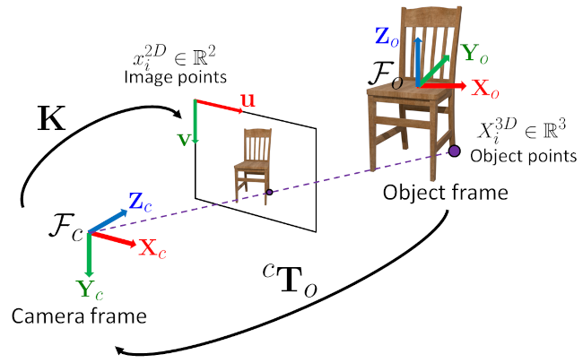
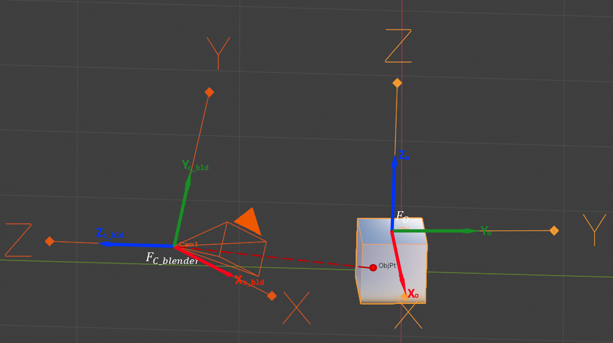
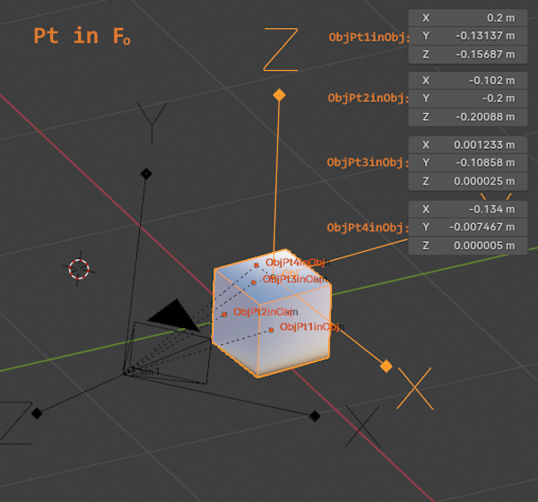
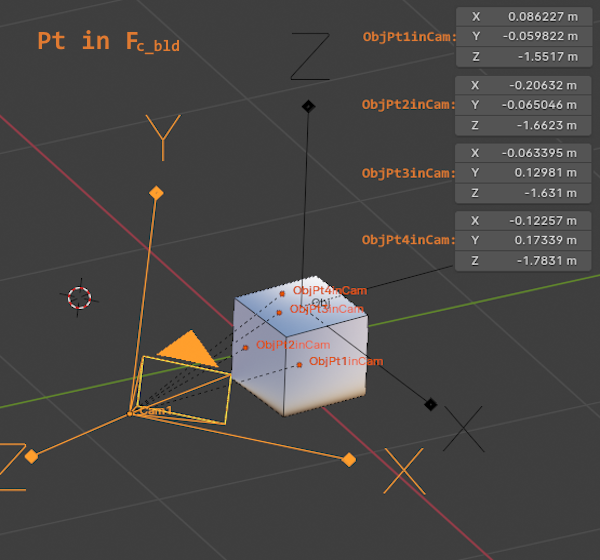
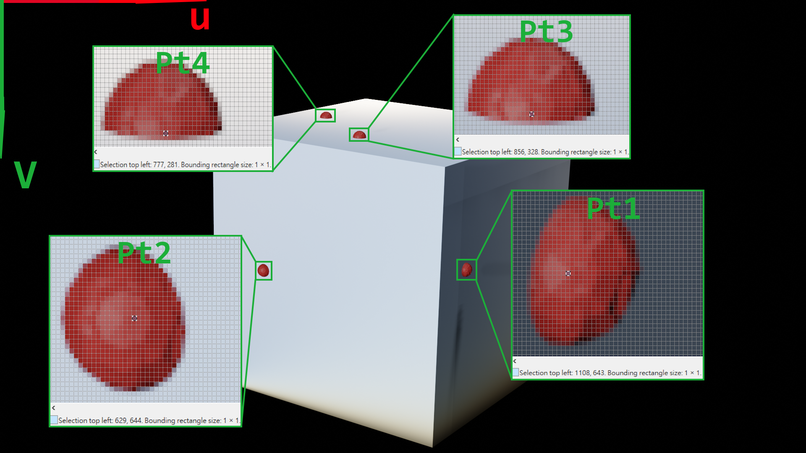

# Pinhole Camera Model Verification in Blender

This note focuses on verifying the pinhole camera model in Blender and
retrieving geometric quantities via the Blender Python API.



**Figure 1.** Reference coordinate frames and homogeneous transformation
defined by the pinhole camera model in OpenCV.


**Figure 2.** Equivalent camera and coordinate frame setup implemented
in Blender to reproduce the OpenCV pinhole camera model.


The rigid transformation from object frame to camera frame is defined as:

- $\mathcal{F}_c$: OpenCV camera coordinate frame.
  The camera coordinate system follows the OpenCV convention, where
  the $Y$-axis points downward
  and the $Z$-axis points forward.
- $\mathcal{F}_{c\text{-}bld}$: Blender camera coordinate frame.
  In contrast to OpenCV, the Blender camera coordinate system uses
  a different axis convention: the $Y$-axis points upward and the
  $Z$-axis points backward.
- $\mathcal{F}_o$: object coordinate frame
- $(X_c, Y_c, Z_c)$: axes of the camera frame
- $(X_{c\text{-}bld}, Y_{c\text{-}bld}, Z_{c\text{-}bld})$: axes of the blender camera frame
- $(X_o, Y_o, Z_o)$: axes of the object frame
- ${}^{c}\mathbf{T}_{o}$: rigid transformation from object frame to camera frame
- $\mathbf{X}_i^{3D} \in \mathbb{R}^3$: 3D object point expressed in $\mathcal{F}_o$
- $\mathbf{x}_i^{2D} \ \in \mathbb{R}^2$: projected 2D image point
- $\mathbf{K}$: camera intrinsic matrix
- $(u, v)$: image plane coordinates


## Workflow Illustrated in Figure 1 [OpenCV]

Step.1: Translation Matrix.
$$
{}^{c}\mathbf{T}_{o}
=
\begin{bmatrix}
^{c}\mathbf{R}_{o} & ^{c}\mathbf{t}_{o} \\
\mathbf{0}^\top & 1 
\end{bmatrix}
$$
Step.2: 3D Point from object coordinate system to camera coordinate system.
$$
\begin{bmatrix}
{}\mathbf{X}_{c} \\
{}\mathbf{Y}_{c} \\
{}\mathbf{Z}_{c} \\
1
\end{bmatrix}
= 
{}^{c}\mathbf{T}_{o} 
\begin{bmatrix}
\mathbf{X}_{o} \\
\mathbf{Y}_{o} \\
\mathbf{Z}_{o} \\
1
\end{bmatrix}
$$
Step.3: 3D Point from camera coordinate system to 2D image coordinate system.
$$
s\begin{bmatrix}
{}\mathbf{u}\\
{}\mathbf{v}\\
{}1 
\end{bmatrix}
= 
{}\mathbf{K} 
\begin{bmatrix}
\mathbf{X}_{c} \\
\mathbf{Y}_{c} \\
\mathbf{Z}_{c} 
\end{bmatrix}
$$

## Workflow Illustrated in Figure 2 [Blender]

Step.1: Translation Matrix.
$$
{}^{c\text{-}bld}\mathbf{T}_{o}
=
\begin{bmatrix}
^{c\text{-}bld}\mathbf{R}_{o} & ^{c\text{-}bld}\mathbf{t}_{o} \\
\mathbf{0}^\top & 1 
\end{bmatrix}
$$
Step.2: 3D Point from object coordinate system to blender camera coordinate system.
$$
\begin{bmatrix}
{}\mathbf{X}_{c\text{-}bld} \\
{}\mathbf{Y}_{c\text{-}bld} \\
{}\mathbf{Z}_{c\text{-}bld} \\
1
\end{bmatrix}
= 
{}^{c\text{-}bld}\mathbf{T}_{o} 
\begin{bmatrix}
\mathbf{X}_{o} \\
\mathbf{Y}_{o} \\
\mathbf{Z}_{o} \\
1
\end{bmatrix}
$$
Step.3: 3D Point from blender camera coordinate system to camera coordinate system.
$$
\begin{bmatrix}
{}\mathbf{X}_{c} \\
{}\mathbf{Y}_{c} \\
{}\mathbf{Z}_{c} \\
1
\end{bmatrix}
= 
\begin{bmatrix}
1 & 0 & 0 & 0 \\
0 & -1 & 0 & 0 \\
0 & 0 & -1 & 0 \\
0 & 0 & 0 & 1
\end{bmatrix}
\begin{bmatrix}
{}\mathbf{X}_{c\text{-}bld} \\
{}\mathbf{Y}_{c\text{-}bld} \\
{}\mathbf{Z}_{c\text{-}bld} \\
1
\end{bmatrix}
$$
Step.4: 3D Point from camera coordinate system to image 2D coordinate system.
$$
s\begin{bmatrix}
{}\mathbf{u}\\
{}\mathbf{v}\\
{}1 
\end{bmatrix}
= 
{}\mathbf{K} 
\begin{bmatrix}
\mathbf{X}_{c} \\
\mathbf{Y}_{c} \\
\mathbf{Z}_{c} 
\end{bmatrix}
$$

## Practical Coordinate Transformation Using the Blender API
Step.1 Get $\ {}^{c\text{-}bld}\mathbf{T}_{o}$  Script:

````
>>> import bpy
>>> Cam_bld = bpy.data.objects['Cam1'] #Blender camera coordinate frame
>>> Obj = bpy.data.objects['Obj'] #Object coordinate frame
>>> To2c_bld = Cam_bld.matrix_world.inverted() @ Obj.matrix_world
````

Step.2 Verify
$(\mathbf{X}_{c\text{-}bld}, \mathbf{Y}_{c\text{-}bld}, \mathbf{Z}_{c\text{-}bld}) = {}^{c\text{-}bld}\mathbf{T}_{o} {\ }(\mathbf{X}_{o}, \mathbf{Y}_{o}, \mathbf{Z}_{o})$ Script:
````
>>> #Obj coordinate
>>> bpy.data.objects['ObjPt1inObj'].location
Vector((0.1999986469745636, -0.13137036561965942, -0.1568709909915924))

>>> #Cam_bld coordinate
>>> To2c_bld @ bpy.data.objects['ObjPt1inObj'].location
Vector((0.08622720837593079, -0.059821613132953644, -1.551675796508789))

>>> #Obj coordinate
>>> bpy.data.objects['ObjPt2inObj'].location
Vector((-0.10199800133705139, -0.1999974399805069, -0.20087629556655884))

>>> #Cam_bld coordinate
>>> To2c_bld @ bpy.data.objects['ObjPt2inObj'].location
Vector((-0.2063189297914505, -0.0650460496544838, -1.662299394607544))

>>> #Obj coordinate
>>> bpy.data.objects['ObjPt3inObj'].location
Vector((0.0012328429147601128, -0.1085837334394455, 2.4646520614624023e-05))

>>> #Cam_bld coordinate
>>> To2c_bld @ bpy.data.objects['ObjPt3inObj'].location
Vector((-0.06339523941278458, 0.12981019914150238, -1.6310244798660278))

>>> #Obj coordinate
>>> bpy.data.objects['ObjPt4inObj'].location
Vector((-0.13400417566299438, -0.007466670125722885, 5.21540641784668e-06))

>>> #Cam_bld coordinate
>>> To2c_bld @ bpy.data.objects['ObjPt4inObj'].location
Vector((-0.12257358431816101, 0.1733890026807785, -1.7830525636672974))
````

Data compare:
|  | ${\ }{\ }{\ }{\ }{\ }{\ }{\ }{\ }{\ }{\ }{\ }(\mathbf{X}_{o}, \mathbf{Y}_{o}, \mathbf{Z}_{o}){\ }{\ }{\ }$ | ${\ }{\ }{\ }{\ }(\mathbf{X}_{c\text{-}bld}, \mathbf{Y}_{c\text{-}bld}, \mathbf{Z}_{c\text{-}bld})$ | ${\ }{\ }{\ }{\ }{}^{c\text{-}bld}\mathbf{T}_{o} {\ }(\mathbf{X}_{o}, \mathbf{Y}_{o}, \mathbf{Z}_{o})$ |
|---|---|---|---|
| $\mathcal{ObjPt_1}$ | $\mathcal{(0.200, -0.131, -0.157)}$ | $\mathcal{(0.086, -0.060, -1.552)}$ | $\mathcal{(0.086, -0.060, -1.552)}$  |
| $\mathcal{ObjPt_2}$ | $\mathcal{(-0.102, -0.200, -0.201)}$ | $\mathcal{(-0.206, -0.065, -1.662)}$  | $\mathcal{(-0.206, -0.065, -1.662)}$ |
| $\mathcal{ObjPt_3}$ | $\mathcal{(0.001, -0.109, 0.000)}$ | $\mathcal{(-0.063, 0.130, -1.631)}$  | $\mathcal{(-0.063, 0.130, -1.631)}$ |
| $\mathcal{ObjPt_4}$ | $\mathcal{(-0.134, -0.007, 0.000)}$ | $\mathcal{(-0.123, 0.173, -1.783)}$  | $\mathcal{(-0.123, 0.173, -1.783)}$ |





Step.3 Convert 
$(\mathbf{X}_{c\text{-}bld}, \mathbf{Y}_{c\text{-}bld}, \mathbf{Z}_{c\text{-}bld})$ to $(\mathbf{X}_{c}, \mathbf{Y}_{c}, \mathbf{Z}_{c})$ Script:

````
>>> bld2cv = Matrix([[1,0,0,0],
... [0,-1,0,0],
... [0,0,-1,0],
... [0,0,0,1]])

#Cam_bld coordinate
>>> bpy.data.objects['ObjPt1inCam'].location
Vector((0.08622720837593079, -0.05982159823179245, -1.551675796508789))

#Cam coordinate
>>> Pt1inCam = bld2cv @ bpy.data.objects['ObjPt1inCam'].location
>>> Pt1inCam
Vector((0.08622720837593079, 0.05982159823179245, 1.551675796508789))

#Cam_bld coordinate
>>> bpy.data.objects['ObjPt2inCam'].location
Vector((-0.2063189446926117, -0.065046027302742, -1.662299394607544))

#Cam coordinate
>>> Pt2inCam = bld2cv @ bpy.data.objects['ObjPt2inCam'].location
>>> Pt2inCam
Vector((-0.2063189446926117, 0.065046027302742, 1.662299394607544))

#Cam_bld coordinate
>>> bpy.data.objects['ObjPt3inCam'].location
Vector((-0.06339524686336517, 0.12981021404266357, -1.6310244798660278))

#Cam coordinate
>>> Pt3inCam = bld2cv @ bpy.data.objects['ObjPt3inCam'].location
>>> Pt3inCam
Vector((-0.06339524686336517, -0.12981021404266357, 1.6310244798660278))

#Cam_bld coordinate
>>> bpy.data.objects['ObjPt4inCam'].location
Vector((-0.12257358431816101, 0.1733890026807785, -1.7830525636672974))

#Cam coordinate
>>> Pt4inCam = bld2cv @ bpy.data.objects['ObjPt4inCam'].location
>>> Pt4inCam
Vector((-0.12257358431816101, -0.1733890026807785, 1.7830525636672974))
````

Step.4 Verify
$s(\mathbf{u}, \mathbf{v}, \mathbf{1}) = {}\mathbf{K} {\ }(\mathbf{X}_{c}, \mathbf{Y}_{c}, \mathbf{Z}_{c})$ Script:
````
>>> K = Matrix([[2666.666667, 0, 960,],
... [0, 2666.666667, 540],
... [0, 0, 1]])

>>> Pt1inUV = K @ Pt1inCam
>>> Pt1inUV = Pt1inUV / Pt1inUV[2]
>>> Pt1inUV
Vector((1108.1876220703125, 642.8076782226562, 0.9999999403953552))

>>> Pt2inUV = K @ Pt2inCam
>>> Pt2inUV = Pt2inUV / Pt2inUV[2]
>>> Pt2inUV
Vector((629.0223388671875, 644.3470458984375, 0.9999999403953552))

>>> Pt3inUV = K @ Pt3inCam
>>> Pt3inUV = Pt3inUV / Pt3inUV[2]
>>> Pt3inUV
Vector((856.3510131835938, 327.7649230957031, 0.9999999403953552))

>>> Pt4inUV = K @ Pt4inCam
>>> Pt4inUV = Pt4inUV / Pt4inUV[2]
>>> Pt4inUV
Vector((776.6835327148438, 280.6858825683594, 1.0))
````
